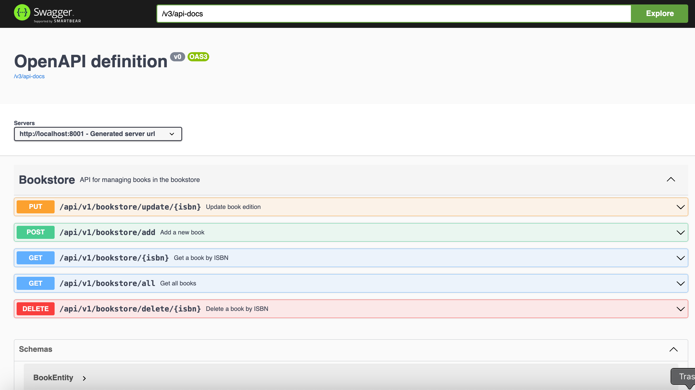

# Bookstore Application - API Documentation

This is a RESTful API for managing a bookstore. The application provides CRUD operations for handling book data. The API is built with Java 11, Spring Boot, Spring Data JPA, MySQL, Gradle, and Lombok.

## Table of Contents

- [Installation](#installation)
- [Configuration](#configuration)
- [API Endpoints](#api-endpoints)
- [Error Codes](#error-codes)
- [Examples](#examples)

---

## Installation

1. Clone the repository and navigate to the project folder.
2. Make sure you have Java 11, Gradle, and MySQL installed.
3. Set up your MySQL database and update your configuration (see [Configuration](#configuration)).
4. Run the application with the following command:
   ```bash
   ./gradlew bootRun
   ```

---

## Configuration

Update the `application.properties` file with your MySQL database information:

```properties
spring.datasource.url=jdbc:mysql://localhost:3306/bookstore
spring.datasource.username=your_mysql_username
spring.datasource.password=your_mysql_password
spring.jpa.hibernate.ddl-auto=update
spring.jpa.show-sql=true
```

- **Database URL**: Replace `localhost:3306` with your database host and port.
- **Username** and **Password**: Replace with your MySQL credentials.

---
##  Swagger UI
http://localhost:8001/swagger-ui.html

http://localhost:8001/swagger-ui/index.html



## API Endpoints

### 1. Get All Books

- **URL**: `/api/v1/bookstore/all`
- **Method**: `GET`
- **Description**: Fetches a list of all books in the bookstore.
- **Response**: Returns an array of book objects.

### 2. Get Book by ISBN

- **URL**: `/api/v1/bookstore/{isbn}`
- **Method**: `GET`
- **Path Variable**: `isbn` (String) - ISBN of the book.
- **Description**: Fetches a book by its ISBN.
- **Response**: Returns a book object if found, or `404 Not Found` if the book doesn’t exist.

### 3. Add a New Book

- **URL**: `/api/v1/bookstore/add`
- **Method**: `POST`
- **Headers**: `Content-Type: application/json`
- **Body**:
  ```json
  {
      "isbn": "1234567890",
      "title": "Book Title",
      "author": "Author Name",
      "edition": "Edition"
  }
  ```
- **Description**: Adds a new book to the bookstore.
- **Response**: Returns the created book object.

### 4. Update Book Edition

- **URL**: `/api/v1/bookstore/update/{isbn}`
- **Method**: `PUT`
- **Path Variable**: `isbn` (String) - ISBN of the book to update.
- **Headers**: `Content-Type: application/json`
- **Body**:
  ```json
  {
      "title": "Updated Book Title",
      "author": "Updated Author",
      "edition": "Updated Edition"
  }
  ```
- **Description**: Updates the details of an existing book, identified by its ISBN.
- **Response**: Returns the updated book object, or `404 Not Found` if the book doesn’t exist.

### 5. Delete Book by ISBN

- **URL**: `/api/v1/bookstore/delete/{isbn}`
- **Method**: `DELETE`
- **Path Variable**: `isbn` (String) - ISBN of the book to delete.
- **Description**: Deletes a book by its ISBN.
- **Response**: Returns `204 No Content` if successful, or `404 Not Found` if the book doesn’t exist.

---

## Error Codes

- **500 Internal Server Error**: General server error, usually due to server configuration or unexpected behavior.
- **404 Not Found**: The requested resource (book) does not exist in the database.
- **400 Bad Request**: The request is invalid, possibly due to malformed JSON or missing fields.

---

## Examples

Here are some JSON payload examples for testing in tools like Postman:

### Example - Add a New Book

```json
{
    "isbn": "9780132350884",
    "title": "Clean Code",
    "author": "Robert C. Martin",
    "edition": "1st"
}
```

### Example - Update Book

URL: `/api/v1/bookstore/update/9780132350884`

```json
{
    "title": "Clean Code: A Handbook of Agile Software Craftsmanship",
    "author": "Robert C. Martin",
    "edition": "2nd"
}
```

---

## Additional Notes

- Ensure that the MySQL database is running and accessible.
- This API uses Lombok to reduce boilerplate code, so ensure your IDE supports it.

For any additional questions or assistance, feel free to reach out. Enjoy using the Bookstore API!
